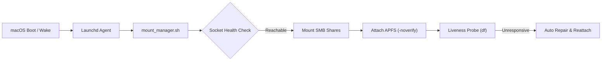

# LazyMount-Mac Documentation

> **Expand your Mac storage effortlessly** — Automated, resilient SMB and cloud storage mounting for macOS power users, NAS gamers, and homelab architects.

---

## 📚 Technical Guides & Troubleshooting

### High-Intent Troubleshooting & Deep Dives

1. **[Fixing Steam Disk Write Error on macOS](troubleshooting/steam-disk-write-error-macos.md)**  
   Comprehensive diagnosis and recovery for corrupted APFS sparsebundles stored over SMB shares. Resolve `EROFS`, `EACCES`, and journal lock errors.

2. **[APFS Sparsebundle NAS Recovery & Optimization](guides/apfs-sparsebundle-nas-recovery.md)**  
   Understanding APFS band structures, fixing truncated `Info.plist`, clearing orphaned lock files, and running non-destructive `fsck_apfs` containers.

3. **[Automounting SMB Shares on macOS Using Launchd](guides/macos-automount-smb-launchd.md)**  
   Overcoming Finder login item limitations with reliable, headless LaunchAgents, sleep/wake network checks, and macOS Keychain integration.

4. **[Rclone Cloud Storage Mount with Launchd & FUSE-T](guides/rclone-launchd-macos.md)**  
   Mounting cloud drives (Google Drive, Dropbox, SFTP, S3) with full VFS local caching on modern Apple Silicon Macs without reducing kernel security.

---

## ⚡ Quick Architecture Overview



---

## 🚀 Quick Start

```bash
# Clone repository
git clone https://github.com/yuanweize/LazyMount-Mac.git
cd LazyMount-Mac

# Copy local configuration template
cp mount_manager.example.local.sh mount_manager.local.sh

# Edit configuration with your share details
nano mount_manager.local.sh

# Test non-destructively
./mount_manager.sh
```

---

## 📄 License & Maintainer

Maintained with care by **Weize Yuan** ([@yuanweize](https://github.com/yuanweize)).  
Licensed under the [MIT License](https://github.com/yuanweize/LazyMount-Mac/blob/main/LICENSE).
